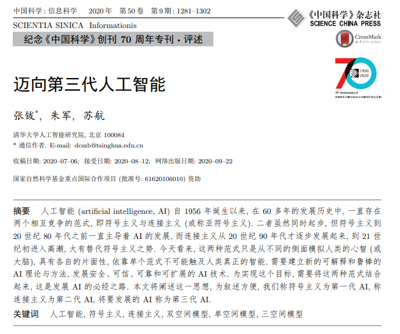

# The Next Decade in AI: Four Steps Towards Robust Artificial Intelligence

> Paper: [The Next Decade in AI: Four Steps Towards Robust Artificial Intelligence](https://arxiv.org/pdf/2002.06177v3.pdf)

## 概述

本文主要探讨了深度学习的局限性，然后提出了可以从结合所谓符号主义的思路来使得整个系统变得更加 Robust ，也就是朝着更强的通用人工智能的泛化能力迈进。

**Deep Learning can fail**

现有的 AI 是所谓狭义的 AI，本质上事从海量的数据中挖掘关联性，而不是因果性。

+ 难以区分一个翻倒的车还是车，因为训练集中没有出现过
+ 无法进行推理，在和训练集稍稍有统计差异的情况下，无法泛化
+ ……

这和人的学习推理能力有本质的区别，因为大脑本来就善于发掘一些东西， 比如加减乘除法， 各种有时间先后事物间的因果关系等。 这就好比我们的大脑里早就配备了一系列的先验算子。 它们帮我们理解了这个世界。

现在需要做的就是要赋予 AI 这种能力。

**符号主义**

符号主义假设人的认知事一种计算，**人类智能和机器智能都是物理符号系统**，符号是人类认知和思维的基本单元，人脑用符号表示知识、按特定规则处理符号。倘若通过研究可以理解人类认知使用的规则和符号，那么让计算机按照同样的规则处理这些符号，就可能创造出高度模拟人类认知的智能机器。

现在的所谓 DL 算法实际上是连接主义的实践，其原理主要为神经网络及神经网络间的连接机制与学习算法。主张模仿人类的神经元，用神经网络的连接机制实现人工智能。

**Four Steps**

1. 规定知识的基本形式
2. 把基本知识整合成无穷多知识的操作系统
3. 通过知识组成模型
4. 利用知识和模型进行认知和推理

## 主要内容

### 规定知识的基本形式

这个世界的任何概念和事实， 都和其它的概念和事实相连接， 如同盘根错节的一棵大树。 如果让AI真正学习一个人类世界的概念， 完全脱离这棵知识树几乎难以想象。 就像你给CNN看了再多的小狗， 它也无法理解小狗是嗷嗷会叫的哺乳动物。然而人类的知识汗牛塞屋， 如果一个个都放进去这是不可能的任务。 我们就需要注意知识本身的层级。 人的知识既包含那些只有维基百科里出现的知识比如某国家的首都， 也包括一些连我们自己都说不出的基本常识，比如什么是运动。 所以我们可以把这些知识分成几个层次： 1 最基础的关于世界物理结构的先验， 比如物体的概念， 平移旋转等运动形式 2， 具体的事物和概念， 类似于知识图谱的形式 3， 关于抽象结构的知识， 如各种逻辑关系， 代数， 语法，一些基本规则。

### 关于知识的操作系统

人类实际是靠组合最基本的知识得到更复杂的知识， 因此事实上真正需要掌握的知识就没有那么多了。 可否让AI也具有类似的能力？这就需要一个关于知识组成成知识的工具系统，并且有一套调用工具的方法。 其实这已经是在说一套操作系统，知识的操作系统。 那么什么是最清晰简洁的操作系统呢？ 其实研究计算机编程的人已经给我们提供了一个很好的范本。

我们说套操作系统要包含的最小算子有variable binding设置变量, instance实例化, 和一系列变量间的基本运算。这就好像我们的面向对象计算机编程，都包含“类“”这个最基本的东西。每个类都如同一种容器， 有一系列变量作为内存里的占位符， 和一系列算子operator和函数规定它们可以如何被操作。

### 进一步加入世界模型

有了操作系统， 知识就不再是零碎的知识 ，而是被组合成世界模型， 在不同的情景下被调用 。 世界模型的本质特征， 是对任务的基本属性进行建模， 从而具有对未来情景的预测能力。 当然这些基本特性是高度依赖于任务的。比如在导航的任务里， 这些基本特性可以是位置的预测和对迷宫边缘形状的记忆。

如果能够把模型加入到当下的深度学习系统里， 将会对当下的深度学习范式产生一场革命。

### 推理

在模型的基础上， 我们就可以达到最后一步， 推理。 推理本质是一种基于知识和模型的推断。 它们的基本组成包含事实，各种常识， 和模型。 不同的人基于同样的事实会得到不同的结果，这是因为他们的背景知识和模型是非常不同的。

比如文中举出了如何让机器理解罗密欧与朱丽叶的剧本的例子，这个例子的主要含义是单纯基于对话语料训练是不可能得到真正的理解的。 因为我们发现语料虽然只有那么几句， 但是背后需要用到的背景知识却是它的几倍。 这是说明如果我们要达到真正的自然语言理解， 需要一个模型把这些隐形的常识和世界运行的规则都包含进去， 否则都做到真正的理解是不可能的。

## 后记

张 院士专门撰文 [迈向第三代人工智能](https://ansafe.xust.edu.cn/DownLoad/2020third-artificial-intelligence.pdf) ，其中认为第三代 AI 发展的思路是把第一代的知识驱动和第二代的数据驱动结合起来，通过利用知识、数据、算法和算力等 4 个要素，构造更强大的 AI，目前存在双空间模型与单一空间模型两个方案。

   

